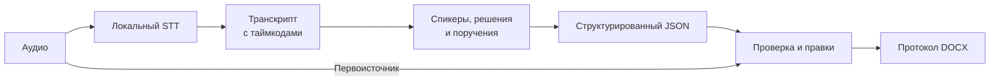

# HackAlem 2026 — Протокол совещания

Локальный ИИ-помощник для Самрук-Қазына превращает запись совещания в протокол с поручениями, которые можно проверить по исходному аудио.

## Проблема

Ручная подготовка протокола занимает время; потерянные поручения и неверные сроки приводят к ошибкам исполнения.

## Решение

Аудиозапись → локальное распознавание → транскрипт с таймкодами → решения и поручения → ответственные и сроки → проверка по аудио → правки человека → DOCX.

## Главное отличие — проверяемость

Поручение может содержать **цитату, таймкод и confidence**. Кнопка **«Проверить в аудио»** воспроизводит исходный фрагмент: пользователь сверяет формулировку, ответственного и срок перед экспортом.

Корпоративный протокол можно проверить, а не принимать вывод ИИ на веру. Confidence — эвристическая оценка, **не измеренная точность**.

## Демо за четыре шага

1. Загрузите запись совещания.
2. Просмотрите содержание, поручения, решения и транскрипт.
3. Проверьте поручение в аудио; исправьте ответственного или срок.
4. Скачайте протокол DOCX и откройте в Word.

## Архитектура



API загрузки и обработки аудио: [pipeline/api.py](pipeline/api.py).

## ИИ и технический стек

- **Речь:** faster-whisper, мультиязычный Whisper small, CPU/int8.
- **Спикеры:** ERes2Net, sherpa-onnx, кластеризация голосов; ответственный — из содержания разговора, не по голосовой биометрии.
- **Извлечение:** правила для поручений, ответственных, сроков и решений; не LLM.
- **Приложение:** Python/FastAPI/Uvicorn, HTML/CSS/JavaScript, IndexedDB; DOCX формируется в браузере.

## Реальный benchmark

«Совещание №1.mp3», один подтверждённый локальный прогон:

| Показатель | Результат |
|---|---|
| Длительность аудио | 274,25 с |
| Обработка | ≈ 99,4 с |
| Реплики транскрипта | 44 |
| Поручения | 10 |
| Переход к аудио и воспроизведение | Проверены |
| Редактирование | Проверено |
| DOCX с правками | Открыт в Microsoft Word |

Точность не измерена; время зависит от оборудования и очереди. Обе benchmark-записи определены как русскоязычные.

Целевые языки проекта — русский, казахский и смешанная RU–KZ речь; для распознавания используется мультиязычный Whisper. **Сквозная работа подтверждена на предоставленных русскоязычных записях.**

## Локальная обработка и закрытый контур

Аудио и текст не отправляются во внешние облачные API. Модели скачиваются при первом использовании. Для закрытого контура нужны предварительная подготовка моделей/зависимостей и отдельная проверка изолированного запуска.

История и аудио хранятся в браузере. Промышленное управление доступом и хранением не реализовано.

## Как запустить

**Windows PowerShell**, корень репозитория. Python 3.11+ в PATH; проверено на 3.14. Проверьте `python --version`. Node.js — только для frontend-тестов.

```powershell
python -m venv .venv
.\.venv\Scripts\python.exe -m pip install -r pipeline\requirements.txt
```

Backend — в первом терминале:

```powershell
.\.venv\Scripts\python.exe -m uvicorn api:app --app-dir pipeline --host 127.0.0.1 --port 8000
```

Frontend — во втором терминале:

```powershell
.\.venv\Scripts\python.exe -m http.server 5173 --bind 127.0.0.1
```

Откройте [приложение](http://127.0.0.1:5173/frontend/). [Health API](http://127.0.0.1:8000/api/health) должен вернуть HTTP 200 и `status: ok`. Обязательных переменных окружения и API-ключей нет.

## Тесты

```powershell
.\.venv\Scripts\python.exe -m unittest discover -s pipeline -p "test_*.py"
node --test frontend/test-runtime.cjs frontend/test-history.cjs
```

**76 backend-тестов** (2 требуют локальных записей результатов) и **41 frontend-тест**: контракт, ошибки, история, правки, аудиопереходы и экспорт. Проверено с Node.js 24.19.

Каталоги `artifacts/` и `examples/` не входят в Git и не используются приложением. API распознаёт каждую новую загруженную запись; готовые benchmark-JSON не подставляются. Два теста повторной проверки сохранённых результатов пропускаются, если локальных файлов нет; их каталог можно указать через `MEETING_REGRESSION_DIR`. Остальные тесты и приложение от этих файлов не зависят.

## Известные ограничения

- Диаризация — прототипная. Метка `SPEAKER_02`, имя в тексте и сотрудник корпоративного справочника — разные сущности; биометрической идентификации участников нет.
- Извлечение решений ещё совершенствуется: встречаются ложные срабатывания.
- Ответственный и срок могут определяться ошибочно или отсутствовать. Саммари шаблонное; PDF нет.

## Дальнейшее развитие

**Hackathon MVP:** Meeting → Verified Protocol.

**Промышленная версия — план:** Meeting → Protocol → Execution Control.

Ближайшие шаги — RU/KZ/mixed регрессионные тесты, аудиобенчмарки и улучшение диаризации. Дальнейший roadmap (не реализован в MVP):

- Интеграция с корпоративным документооборотом (СЭД).
- Контроль исполнения поручений.
- Автоматическая доставка протокола и уведомлений.
- Приоритизация поручений.
- Корпоративная идентификация участников: связь speaker ID с профилем участника или справочником.

## Команда

Два разработчика: backend/AI и frontend/интеграция.
